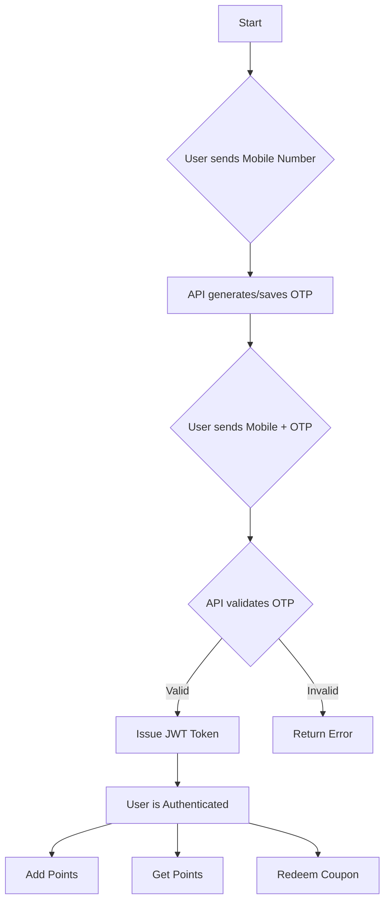

# Member Rewards API

This project is a basic **RESTful API** built with **.NET 8** and **PostgreSQL** to manage members and their reward points.  
It includes functionalities for **member registration, OTP verification, points management, and coupon redemption**, all secured with **JWT-based authentication**.

---

## Project Structure

The project follows a standard .NET API structure to separate concerns and improve maintainability.

```
MemberRewards/
├── Controllers/        # Handles incoming HTTP requests
│   ├── MembersController.cs
│   ├── PointsController.cs
│   └── CouponsController.cs
├── Data/               # Database context and migrations
│   ├── ApplicationDbContext.cs
│   └── Migrations/
├── DTOs/               # Data Transfer Objects for API requests/responses
│   ├── MemberDtos.cs
│   └── AuthDtos.cs
├── Models/             # EF Core entity models
│   ├── Member.cs
│   ├── Point.cs
│   └── Coupon.cs
├── Services/           # Business logic
│   ├── IAuthService.cs
│   ├── AuthService.cs
│   ├── IMemberService.cs
│   └── MemberService.cs
├── wwwroot/            # Static files for the basic webpage
│   ├── index.html
│   └── script.js
├── appsettings.json    # Configuration settings
├── Program.cs          # Main application entry point
└── MemberRewards.csproj  # Project file
```

---
## Postman Collection

https://sahaj-s-team.postman.co/workspace/My-Workspace~05050fb7-7f40-4a8f-8d59-af4043b6c8ea/collection/47897660-a7944636-d4ae-4b09-9ff2-f774ef0accd5?action=share&creator=47897660

## Database Schema (PostgreSQL)

The database consists of three main tables to manage members, points, and coupons.

### Tables
- **Members**: Stores member information, including mobile number, OTP details, and total points.  
- **Points**: A transaction log for all points added to a member's account.  
- **Coupons**: Stores information about coupons that have been redeemed by members.  

### SQL Schema + Sample Data

```sql
-- Table to store member information
CREATE TABLE "Members" (
    "Id" SERIAL PRIMARY KEY,
    "MobileNumber" VARCHAR(15) UNIQUE NOT NULL,
    "Otp" VARCHAR(6),
    "OtpExpiry" TIMESTAMP,
    "IsVerified" BOOLEAN NOT NULL DEFAULT FALSE,
    "TotalPoints" INTEGER NOT NULL DEFAULT 0,
    "CreatedAt" TIMESTAMP NOT NULL DEFAULT CURRENT_TIMESTAMP
);

-- Table to store points transactions
CREATE TABLE "Points" (
    "Id" SERIAL PRIMARY KEY,
    "MemberId" INTEGER NOT NULL,
    "PointsAdded" INTEGER NOT NULL,
    "TransactionDate" TIMESTAMP NOT NULL DEFAULT CURRENT_TIMESTAMP,
    FOREIGN KEY ("MemberId") REFERENCES "Members" ("Id")
);

-- Table to store redeemed coupons
CREATE TABLE "Coupons" (
    "Id" SERIAL PRIMARY KEY,
    "MemberId" INTEGER NOT NULL,
    "CouponCode" VARCHAR(50) UNIQUE NOT NULL,
    "Value" INTEGER NOT NULL,
    "RedeemedAt" TIMESTAMP NOT NULL DEFAULT CURRENT_TIMESTAMP,
    FOREIGN KEY ("MemberId") REFERENCES "Members" ("Id")
);

-- Sample Data
INSERT INTO "Members" ("MobileNumber", "IsVerified", "TotalPoints") VALUES
('1234567890', TRUE, 1500),
('0987654321', FALSE, 250);
```

---

##  Project Setup Guide

Follow these steps to get the project running on your local Windows machine.

### Prerequisites
- [.NET 8 SDK](https://dotnet.microsoft.com/en-us/download/dotnet/8.0)
- [Visual Studio 2022](https://visualstudio.microsoft.com/vs/) (with **ASP.NET workload**)
- [PostgreSQL](https://www.postgresql.org/download/)

---

### Steps

#### 1. Clone the Repository
```bash
git clone <your-repository-url>
cd MemberRewardsAPI
```

#### 2. Setup the Database
- Open **pgAdmin 4** and create a new database named:  
  `MemberRewardsDb`

#### 3. Configure the Application
- Open the project in **Visual Studio**.  
- In `appsettings.json`, update the **DefaultConnection** string:

```json
"ConnectionStrings": {
  "DefaultConnection": "Host=localhost;Database=MemberRewardsDb;Username=postgres;Password=your_password"
}
```

#### 4. Update the Frontend API Port
When you run the API, check the port number in the URL (e.g., `https://localhost:7123`).  
Update it in **wwwroot/script.js**:

```javascript
const API_BASE_URL = 'https://localhost:7123/api'; // Make sure this port is correct!
```

#### 5. Run Database Migrations
Open **Package Manager Console** in Visual Studio:

```bash
dotnet ef migrations add InitialCreate
dotnet ef database update
```

#### 6. Run the API
Press **F5** or click the green play button in Visual Studio.  
A browser window will open with **Swagger UI**, which you can use to test the API.

---

## Functional Flow Diagram



---

## 📡 Sample API Endpoints

All endpoints are prefixed with `/api`.  
Authenticated endpoints require a **Bearer token** in the `Authorization` header.

| Feature             | Method | Endpoint              | Auth Required |
|---------------------|--------|----------------------|--------------|
| Register Member     | POST   | `/Members/register`  | No           |
| Verify OTP          | POST   | `/Members/verify`    | No           |
| Add Points          | POST   | `/Points/add`        | Yes (JWT)    |
| Get Member Points   | GET    | `/Points/{memberId}` | Yes (JWT)    |
| Redeem Coupon       | POST   | `/Coupons/redeem`    | Yes (JWT)    |

---

